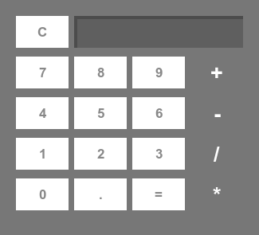

# Calculator

## Little bit more than a simple Calculator built using HTML, CSS & Javascript

Just open index.html in any browser and it will open the calculator app in your browser window.

Also I have included the package.json and bootstrap.js files, so this app can be built and run using electron.

Just check the dependencies in package.json before building and running with electron.

### Do 'npm install' to install dependencies for electron

Works succesfully in Mozilla Firefox v61.0 and also with electron too (Just do 'npm start' to test with electron).

To build the desktop app, first install electron-packager with
### npm install electron-packager

and then 

## ./node-modules/.bin/electron-packager . KalC --asar --overwrite

##### Also included nthRoot function which can be use to used to calculate nth root of any number 'm' by calling as nthRoot(m,n).

##### Brackets also added to enable BODMAS/PEMDAS.

Since I am using eval to calculate whats on screen, so why don't you try calculating something like - '2**4'

###### 

## To run in browser all you need is index.js, index.html and calculator.css.
