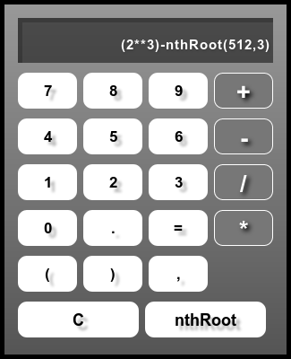

# Calculator
##  Simple Kalculator
Calculator built using HTML, CSS, Javascript

Just open index.html in any browser and it will open the calculator app in your browser window.

Also I have included the package.json and bootstrap.js files, so this app can be built and run using electron.

Just check the dependencies in package.json before building and running with electron.

Do 'npm install' to install dependencies

Works succesfully in Mozilla Firefox v61.0 and also with electron too (Just do 'npm start').

Since I am using eval to calculate whats on screen, so 

why don't you try calculating like - '2**4'

